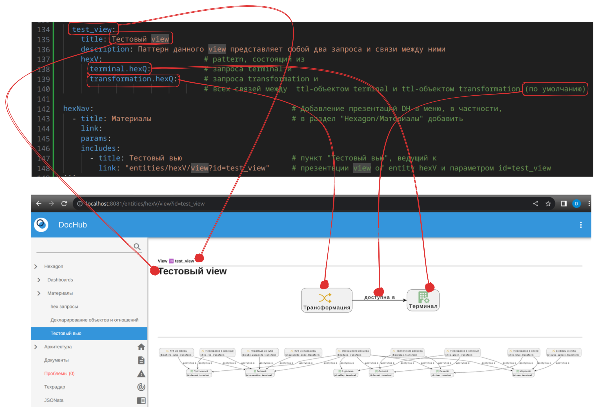

###### :orange_book: Hexagon entry article (readme.md)

---

# Hexagon

**Hexagon** – это функциональное дополнение к DocHub-репозиториям (DocHub add-on)

###### TBD:
    Hexagon - опция. Hexed apps. 

Для описания архитектуры в виде кода в Hexagon используется yaml и ряд json schemas, образующих hex-native язык:
* декларирование объектов и отношений в формате направленного графа, где объекты представлены вершинами (узлами, nodes), а отношения -- ребрами (связями, edges);
* запросы (queries) к графу следующего вида: все ноды, которые имеют связь (любую или определенную) с нодами, которые имеют связь... Не путать с jsonata-запросами.
* описание представлений архитектуры в виде pattern(комбинация запросов) + landscape(результат комбинации запросов) с возможностью предоставления пользователю DH-портала применения фильтров
* интерпретация кода архитектуры, написанного в других схемах (TBD)

#### Декларирование объектов и отношений
Все объекты архитектуры с точки зрения Hexagon являются однотипными или True Typeless (seaf.ba.ttl). То есть и объект "Горный терминал", и объект "Куб из сферы" будут относиться к типу seaf.ba.ttl. Поэтому декларирование этих объектов будет выглядеть следующим образом:
```yaml
seaf.ba.ttl:                               # раздел манифеста, в котором объявляются любые объекты архитектуры
    mountine_terminal:             # уникальный идентификатор объекта (рекомендуем использовать концепцию DDD)
        title: Горный терминал     # наименование наименование объекта

    sphere_cube_transform:
        title: Куб из сферы
```

Если между парой объектов архитектуры существует отношение, например "Трансформация 'Куб из сферы' *доступна в* 'Горном терминале'  ", то объявляение такого отношения осуществляется следующим образом:
```yaml
seaf.ba.ttl:                        
    mountine_terminal:              
        title: Горный терминал

    sphere_cube_transform:          # объект-источник (source) связи
        title: Куб из сферы
        hex:                        # атрибут объекта в котором объявляются связи
            =>доступен:             # направление и наименование связи
                mountine_terminal:  # объект-приемник (target) связи
```

На данном этапе ни DH, ни Hexagon ничего "не знают" о природе декларируемых объектов. Это два каких-то связанных объекта. Для того, что бы в дальнейшем опрерировать такими категориями как "Терминал" и "Трансформация", их необходимо задекларировать, как и "обычные" объекты:

```yaml
seaf.ba.ttl:                        
    terminal:              
        title: Терминал

    transformation:          
        title: Трансформация
```
Для того, чтобы "Горный терминал" и "Куб из сферы" относились к категории (классу, признаку и т.д.) "Терминал" и "Трансформация" соответственно, необходимо задеклариировать отношения между классами и экземплярами. В примере ниже используется отношение `map`, но можно выбрать любое отношение:
```yaml
seaf.ba.ttl:                        
    mountine_terminal:              
        title: Горный терминал
        hex:
            =>map:                  # мэппинг Горного терминала
                terminal:           # на класс Терминал

    sphere_cube_transform:          
        title: Куб из сферы
        hex:
            =>map:                  # мэппинг Куб из сферы
                transformation:     # на класс Трансформация
            =>доступен:            
                mountine_terminal:  
```
###### в папке hexagon/articles/abstract_example находится манифест с примером вымышленных Терминалов и доступных трансформаций. Подключите манифест terminals.yaml

Для получения перечня всех объектов  и отношений можно воспользоваться jsonata-запросами:
```jsonata
$eval($$.hexF.nodes) /* все объекты */
```
```jsonata
$eval($$.hexF.edges) /* все отношения */
```

[подробнее о декларировании объектов и отношений](/entities/articles/blank?id=hex_declare)

#### Запросы к графу
Запрос - это специальный атрибут `hexQ` seaf.ba.ttl-объекта, описывающий условия по наличию/отсутствию отношений с другими объектами. Запросы возвращают массив идентификаторов объектов архитектуры, удовлетворяющих заданным условиям. 

Например, требуется получить перечень всех терминалов:
```yaml
seaf.ba.ttl:
    all_terminals:              # идентификатор запроса
        title: все терминалы    # имя запроса
        hexQ:                   # атрибут, содержащий запрос
            seaf.ba.ttl:                # все seaf.ba.ttl-объекты, которые
                EVERY=>map:     # в обязательном порядке имеют исходящую связь "map"
                    terminal:   # к объекту terminal
```
Выполнить запрос можно с помощью jsonata:
```jsonata
$eval($$.hexF.queryExe, {"qId": "all_terminals"})
```
Поскольку запрос - это seaf.ba.ttl-объект, то мы можем поместить тело запроса, например в объект terminal:
```yaml
seaf.ba.ttl:                        
    terminal:              
        title: Терминал
        hexQ:                   
            seaf.ba.ttl:                
                EVERY=>map:     
                    terminal:   
```
Теперь при обращении terminal является и обычным seaf.ba.ttl-объектом и запросом одновременно:
```jsonata
(
    $lookup(seaf.ba.ttl, "terminal").title;              /* Терминал */
    eval($$.hexF.queryExe, {"qId": "terminal"}); /* [
                                                        "mountine_terminal",
                                                        "river_terminal",
                                                        "valley_terminal",
                                                        "desert_terminal",
                                                        "sea_terminal",
                                                        "forest_terminal"
                                                    ]
                                                 */
)
```
[Подробнее о запросах](/entities/articles/blank?id=hex_queries)

#### Визуализация (views)
Визуализация определенной части графа называется "view" (вью, представление). В Hexagon представления описываютяся (декларируются) кодом и строятся следующим образом:
* seaf.ba.ttl-объект, содержащий в себе определение view -- заголовок, описание, статья выводятся в верхней части view
* декларируемая часть (определение) -- представляет собой pattern (что показывает view) и отображается в виде графа с селекторами
* вычисляемая часть -- результат применения паттерна к графу -- подграф, соответствующий паттерну.

Рассмотрим пример:
```yaml
seaf.ba.ttl:  
  test_view:
    title: Тестовый view
    description: Паттерн данного view представляет собой два запроса и связи между ними
    hexV:                       # pattern, состоящий из
      terminal.hexQ:            # запроса terminal и
      transformation.hexQ:      # запроса transformation и
                                # всех связей между  seaf.ba.ttl-объектом terminal и seaf.ba.ttl-объектом transformation (по умолчанию)

hexNav:                                             # Добавление презентаций DH в меню, в частности,
  - title: Материалы                                # в раздел "Hexagon/Материалы" добавить
    link: 
    params:
    includes:
      - title: Тестовый вью                         # пункт "Тестовый вью", ведущий к
        link: "entities/hexV/view?id=test_view"     # презентвции view of entity hexV и параметром id=test_view
```


Часто мы хотим предоставить пользователю возможность "проанализировать" представление, то есть предоставить ему возможность увидеть одну и ту же часть архитектры немного под разными углами. Тогда имеет смысл сгруппировать несколько views:

```yaml
seaf.ba.ttl:
  test_view_moded:
    title: Тестовый view (moded)
    hexV:
      modes:
        - title: Морской
          hexV:
            sea_terminal:
            transformation.hexQ:
        - title: Речной
          hexV:
            river_terminal:
            transformation.hexQ:
        - title: Лесной
          hexV:
            forest_terminal:
            transformation.hexQ:
        - title: Горный
          hexV:
            mountine_terminal:
            transformation.hexQ:
        - title: Равнинный
          hexV:
            valley_terminal:
            transformation.hexQ:
        - title: Пустынный
          hexV:
            desert_terminal:
            transformation.hexQ:
```

Попробуйте представление Hexagon/материалы/Тестовый вью (moded). [Подробнее о вью модах](/entities/articles/blank?id=hex_views)